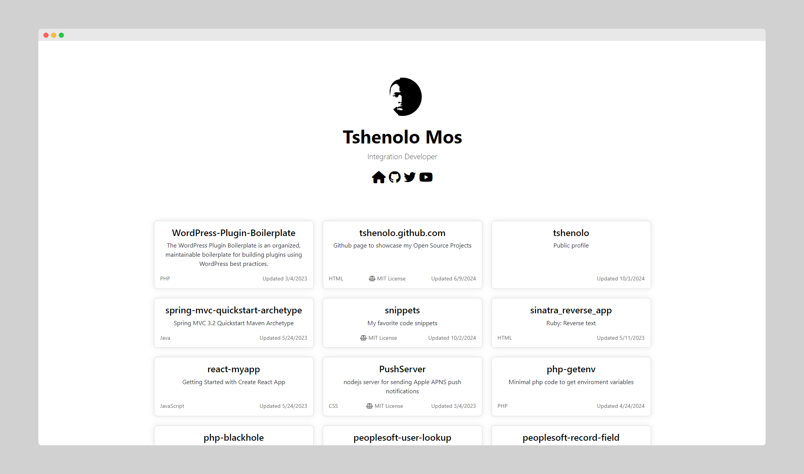
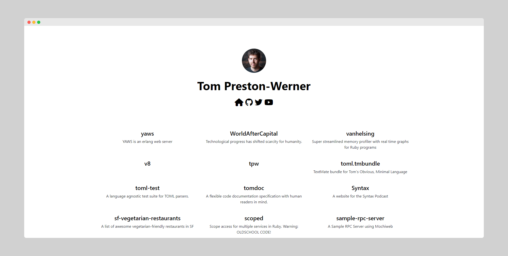

# My Open Source Projects

This repository hosts the open source projects that I have created or contributed to. You can view the live version of the site [here](https://tshenolo.github.io).



## Usage

If you want to clone and run this repository in your local setup, follow these instructions:

1. First, clone the repository by opening a terminal in your workspace directory and running:

```bash
git clone https://github.com/tshenolo/tshenolo.github.com.git
```

2. Navigate to the cloned repository:

```bash
cd tshenolo.github.com
```

3. Customize it using vscode
```bash
code .
```

👉🏻 NOTE: Change username in the javascript to load your own profile and repositories




4. Run a simple, zero-configuration command-line HTTP server powered by the http-server package 
```bash
npx http-server
```

4. Open your web browser and visit http://localhost:8080.

## TODO
- [x] Make index.html customizable  
- [x] Add screenshot  
- [x] Store data using indexedDB  
- [x] Create function to clear local data  
- [x] Add dark mode CSS 
- [ ] Add download repo icon
- [ ] Add icons under each repo
- [ ] Add more features  


## Contributing
Contributions to this repository are always welcome. Whether it's enhancing the user interface, improving the code, or reporting issues, your help is appreciated!

1. Fork the Project
2. Create your Feature Branch (git checkout -b feature/AmazingFeature)
3. Commit your Changes (git commit -m 'Add some AmazingFeature')
4. Push to the Branch (git push origin feature/AmazingFeature)
5. Open a Pull Request

## License
Distributed under the [MIT](LICENSE) License.

## Thank you for the Support
- ⭐ Give this repo a ⭐ star ⭐ at the top of the page
- 🐦 Follow me on twitter [twitter](https://twitter.com/tshenolo)
- 📺 Subscribe to my [Youtube channel](https://www.youtube.com/@tshenolo?sub_confirmation=1)

### Built with:


