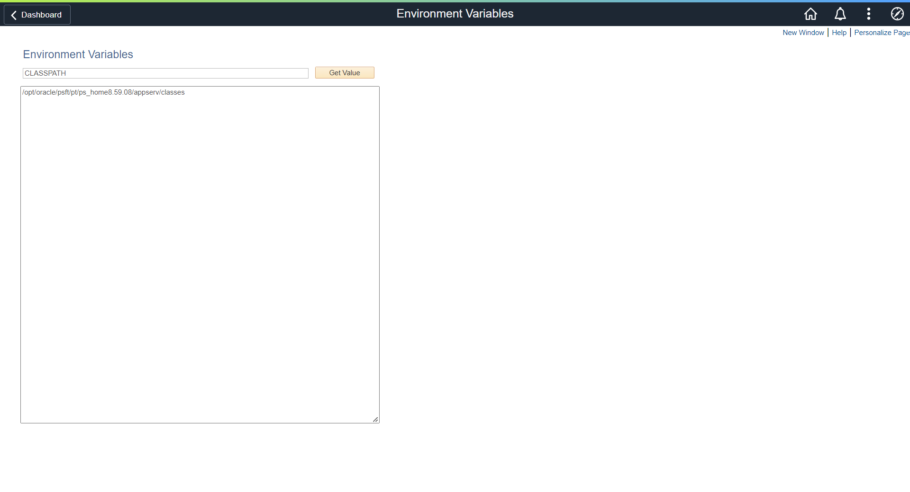

# Projects

### Query Search
PeopleSoft utility designed to search for specific text in all PS Queries within PeopleSoft and identify which PS Queries contains that text.
- Technology: peoplesoft
- URL: https://tshenolo.gumroad.com/l/peoplesoft-query-search

### List/Download Files
PeopleSoft utility to list files and download files.
- Technology: peoplesoft
- URL: https://tshenolo.gumroad.com/l/peoplesoft-file-list

### File Manager
PeopleSoft utility to navigate the PeopleSoft file system. It allows users to view contents of folders and download files.
- Technology: peoplesoft
- URL: https://tshenolo.gumroad.com/l/peoplesoft-file-manager

### File Stream
PeopleSoft utility to stream files directly to the PeopleSoft file system.
- Technology: peoplesoft
- URL: https://github.com/tshenolo/peoplesoft-file-stream

### File Upload
PeopleSoft utility to upload files from your computer to a specific folder on a PeopleSoft server.
- Technology: peoplesoft
- URL: https://tshenolo.gumroad.com/l/peoplesoft-file-upload

### Environment Variables
PeopleSoft utility to get environment variables defined within a PeopleSoft server.
- Technology: peoplesoft
- URL: https://github.com/tshenolo/peoplesoft-env-variable

### PeopleSoft Component Navigation
PeopleSoft utility to get the navigation from the name of a PeopleSoft Component
- Technology: peoplesoft
- URL: https://tshenolo.gumroad.com/l/peoplesoft-component-nav

### PeopleSoft Process Navigation
PeopleSoft utility to get the navigation from the name of a PeopleSoft process
- Technology: peoplesoft
- URL: https://tshenolo.gumroad.com/l/peoplesoft-process-nav

### PS Query SQL
PeopleSoft utility to get the SQL of a PeopleSoft PS Query
- Technology: peoplesoft
- URL: https://tshenolo.gumroad.com/l/peoplesoft-query-sql

### Record Fields
PeopleSoft utility to get record fields.
- Technology: peoplesoft
URL: https://github.com/tshenolo/peoplesoft-record-field
- 

### Personal Website
Portfolio Website. 2020 Redesign and Rebrand
- Task: Design and development
- Year: 2020
- URL: http://tshenolo.me/

### High Ridge School
Highridge English Medium Primary School is a private school offering excellent educational experience for students from standard 1 to 7 and PSLE examination
- Task: Design and development
- Year: 2018

### NALCGPMWU
National Amalgamated local and Cetral Government, Parastatal Workers Union. The goal of the website/application is to automate a manual process of tracking information using spreadsheet. The application tracks all relevant information and allow employees of the union to manage information about the union
- Task: Design and development
- Year: 2018

### Personal Website
Personal Website for displaying some of my work.
- Task: Design and development
- Year: 2017
- URL: http://tshenolo.me/

### Black Eagle Loans
Black Eagle Loans is a Botswana based micro-lending company which offers short term and long term loans to clients.
- Task: Design and development
- Year: 2016
- URL: https://www.blackeagleloans.com/

### Borgadie
Bogadi is an image consultant, fashion stylist and qualified makeup artist.
- Task: Design and development
- Year: 2016
- URL: http://www.borgadie.com/

### Gatewayoutsource
A platform for renting camping equipment
- Task: Design and development.
- Year: 2016

### Peaceful Living Home Care
PLHC is a provider in private duty home care assistence throughout Connecticut
- Task: Design and development.
- Year: 2016

### Keiko Events
Keikoevents is an events management company
- Task: Design and development
- Year: 2015
- URL: http://www.keikoevents.com/

### Keiko Network
Keikonetwork is an Event Management and IT Consulting agency
- Task: Design and development
- Year: 2015
- URL: http://www.keikonetwork.com/

### Keiko Tech
Keikotech is a company that offers Information Technology Services.
- Task: Design and development
- Year: 2015
- URL: http://www.keikotech.com/

### Splendidconsultants
Splendid Consultants is a Safety, Health, Environmental, Business, and an Integrated Environmental Management organization
- Task: Design and development
- Year: 2015

### Kalahari Donkey
An online store for selling Donkey Milk related products
- Task: Design and development.
- Year: 2015

### Salima Sweets
A Bakery dedicated to making quality preservative free baked good.
- Task: Design and development.
- Year: 2015

### MUWS API
An API that allows developers to parse weather parameters officially available at McMaster University Weather Station using XML, JSON, HTML, JavaScript and JQuery
- Task: Design and development
- Year: 2014

### Bookedyou
A calendar based portal for managing events
- Task: Design and development
- Year: 2012
- URL: http://www.bookedyou.com/

### Tricky triangle Board Game
Native iOS tricky triangle board game.
- Task: Design and development, Converted to multi-platform mobile app using Ionic framework.
- Year: 2012
- URL: http://tshenolo.me/apps/trickytriangle/index.html

### Personal Website
Personal Website for displaying some of my work.
- Task: Design and development
- Year: 2009

### Personal Website
First personal website. Mainly used for hosting links to my courses
- Task: Design and development.
- Year: 2005

